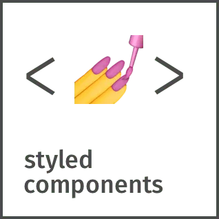

# Hi! I'm Jaden 👋
I'm a high school student from Toronto who enjoys math 📝, dogs 🐕, and watching football ⚽.
You can find me working on my latest projects 👨‍💻, teaching 👨‍🏫, playing chess ♟️, or doing anything else I'm interested in.

Feel free reach out to me through my socials. I'd love to talk! 🤝

## Skills
##### Languages

 

#####  Tools/Frameworks/Libraries

 

## Socials 📫 
[Linkedin](https://www.linkedin.com/in/jaehyeongpark)

[Email](mailto:jaehyeongpark06@gmail.com)

[Personal Site](https://jaehyeongpark.social)

## Hobbies/Interests
Watching football ⚽ 

Chess ♟️

Math 📝

<!--
**JaehyeongPark06/JaehyeongPark06** is a ✨ _special_ ✨ repository because its `README.md` (this file) appears on your GitHub profile.

Here are some ideas to get you started:

- 🔭 I’m currently working on ...
- 🌱 I’m currently learning ...
- 👯 I’m looking to collaborate on ...
- 🤔 I’m looking for help with ...
- 💬 Ask me about ...
- 📫 How to reach me: ...
- 😄 Pronouns: ...
- ⚡ Fun fact: ...
-->
